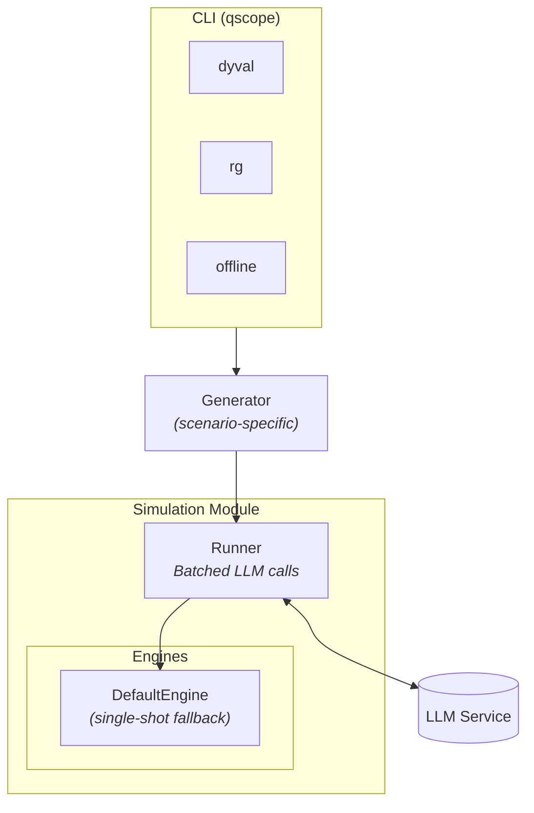

# Simulation Module

Executes evaluation scenarios against LLM agents: prompt generation → LLM calls → response parsing → metrics.

## Architecture



**Key points:**
- **Generator** produces `ScenarioRow` objects from search parameters
- **Runner** drives **Engines** which handle execution logic
- **Engines** use **ResponseHandlers** for parsing and **Metrics** for aggregation
- **Unregistered components fall back to `default` implementations**

---

## Creating a New Scenario (Minimal Example)

The simplest way to add a scenario is to **only create what's different**. Any component you don't register falls back to the `default` implementation.

### Auto-Discovery

The `ComponentRegistry` automatically discovers and imports scenario modules when they're first used. You don't need to add explicit imports anywhere—just use the `@ComponentRegistry.generator("my_scenario")` decorator and your generator will be found.

**Supported file patterns** (tried in order):

| Pattern | Example |
|---------|---------|
| `quickscope.simulation.<scenario>` | `simulation/my_scenario/__init__.py` |
| `quickscope.simulation.<scenario>.<scenario>_generator` | `simulation/my_scenario/my_scenario_generator.py` |
| `quickscope.simulation.<scenario>.generator` | `simulation/my_scenario/generator.py` |
| `quickscope.simulation.<scenario>.engine` | `simulation/my_scenario/engine.py` |

Pick whichever pattern fits your preference. The first match that contains a registered component wins.

### Example: Adding "my_scenario" with just a generator

**Option A: Single file with `<scenario>_generator.py` naming**

```
quickscope/simulation/my_scenario/
└── my_scenario_generator.py    # Auto-discovered!
```

```python
# my_scenario_generator.py
from quickscope.simulation.abstract import ComponentRegistry, ScenarioGenerator
from quickscope.simulation.abstract.schemas import BaseRow

@ComponentRegistry.generator("my_scenario")
class MyScenarioGenerator(ScenarioGenerator):
    """Generates my_scenario evaluations from search parameters."""
    
    def generate(self, params: dict, rng=None) -> BaseRow:
        return BaseRow(
            scenario_id=f"my_{params['difficulty']}_{rng.integers(10000)}",
            scenario_text=self._build_question(params),
            model_name=self.model,
            reference_answer=str(params["expected"]),
        )
```

**Option B: Package with `__init__.py`**

```
quickscope/simulation/my_scenario/
├── __init__.py        # Imports generator to trigger registration
└── generator.py       # Contains the generator class
```

```python
# generator.py
from quickscope.simulation.abstract import ComponentRegistry, ScenarioGenerator
from quickscope.simulation.abstract.schemas import BaseRow

@ComponentRegistry.generator("my_scenario")
class MyScenarioGenerator(ScenarioGenerator):
    # ... same as above
```

```python
# __init__.py
from .generator import MyScenarioGenerator  # Triggers registration on import
```

**That's it!** Since we only registered a generator:
- **Engine** → falls back to `DefaultEngine`
- **ResponseHandler** → falls back to `DefaultResponseHandler`  
<!-- - **Metrics** → falls back to `StaticMetrics` -->

You can use it by adding an appropriate CLI command or by wiring the generator
through the existing pipeline setup used by `dyval`, `rg`, and `offline`.

### Adding a custom CLI entrypoint (optional)

If you want scenario-specific CLI options, add a subcommand to `cli.py`:

```python
@main.command(name="my-scenario")
@click.option("--custom-flag", default=False, help="My scenario-specific option")
@common_options  # Adds --model, --utility, --n-batches, etc.
def my_scenario(custom_flag, model, utility, n_batches, ...):
    """Run adaptive search for my_scenario."""
    generator = MyScenarioGenerator(model=model, custom_flag=custom_flag)
    # ... setup pipeline
```

See `dyval` or `rg` in `quickscope/cli.py` for complete examples.

### Adding a search space

```yaml
# resources/search_spaces/my_scenario/space.yaml
difficulty:
  type: integer
  lower: 1
  upper: 10
expected:
  type: integer
  lower: 0
  upper: 100
```

### Adding a custom utility (optional)

```python
# resources/search_spaces/my_scenario/utility.py
from quickscope.dataflow.utility_registry import register_utility

@register_utility("my-score", scenario="my_scenario")
def my_score(metrics: dict) -> float:
    return 1.0 - metrics.get("accuracy", 0.0)  # e.g., find hard cases
```

---

## When to Override Components

| Override | When to use |
|----------|-------------|
| **Engine** | Multi-turn interactions, multi-agent scenarios, custom state management |
| **ResponseHandler** | Non-standard answer formats, complex parsing logic |
| **Metrics** | Custom aggregation beyond accuracy/exact-match |
| **Schemas** | Additional required fields beyond `BaseRow`/`BaseResult` |

### Custom Response Handlers

To create a custom handler, **subclass the appropriate base handler** for your engine type:

```python
# simulation/code_eval/response_handler.py
from quickscope.simulation.abstract import ComponentRegistry
from quickscope.simulation.default.response_handler import DefaultResponseHandler
from quickscope.simulation.default.schemas import DefaultRow

@ComponentRegistry.handler("code_eval")
class CodeResponseHandler(DefaultResponseHandler):
    """Parses code blocks instead of \\boxed{}."""
    
    def parse_response(self, response: str, scenario: DefaultRow) -> str | None:
        # Override just the parsing logic
        match = re.search(r'```(?:python)?\s*(.*?)```', response, re.DOTALL)
        return match.group(1).strip() if match else None
    
    # Inherits _normalize_logprobs(), extract_mcq_distribution(), etc.
```

Custom handlers for the default single-shot engine should subclass
`DefaultResponseHandler` so logprob normalization and MCQ parsing helpers remain
available.

---

## Quick Reference

| Component | Auto-Discovered Locations | Fallback |
|-----------|---------------------------|----------|
| Generator | `<scenario>_generator.py`, `generator.py`, or `__init__.py` | (required) |
| Engine | `engine.py` or `__init__.py` | `DefaultEngine` |
| ResponseHandler | `response_handler.py` or `__init__.py` | `DefaultResponseHandler` |
<!-- | Metrics | `metrics.py` | `StaticMetrics` | -->
| Search Space | `resources/search_spaces/<scenario>/space.yaml` | — |
| Utilities | `resources/search_spaces/<scenario>/utility.py` | — |

> **Note:** All files should be in `quickscope/simulation/<scenario>/`. The decorator (`@ComponentRegistry.generator()`, etc.) is what registers the component—the file name just determines how it's auto-discovered.

---

## Dataset Row Format (Offline Scenarios)

For dataset-backed scenarios, rows need `BaseRow` fields. Extra fields go to `metadata`:

```json
{
  "scenario_id": "example_001",
  "scenario_text": "What is 6 * 7?",
  "model_name": "gpt-4o-mini",
  "reference_answer": "42",
  "domain": "arithmetic"
}
```

> **Note:** `domain` and other extra fields are captured in `metadata`. Access via `result.metadata.get("domain")`.
